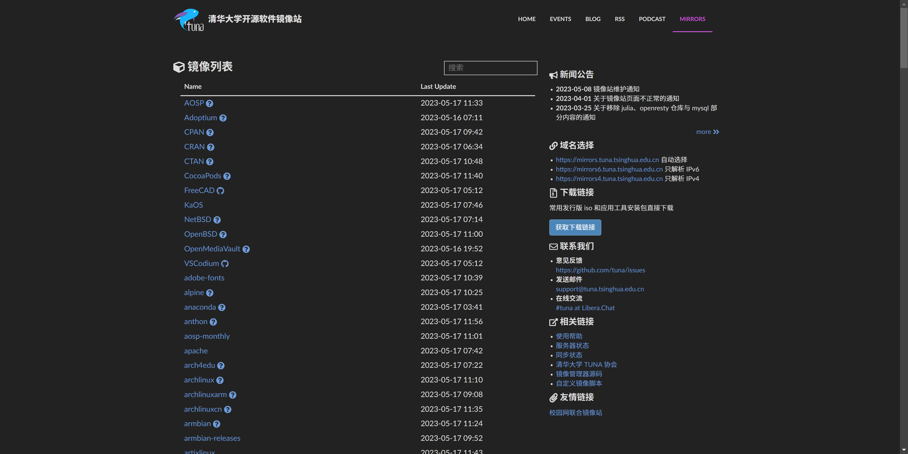
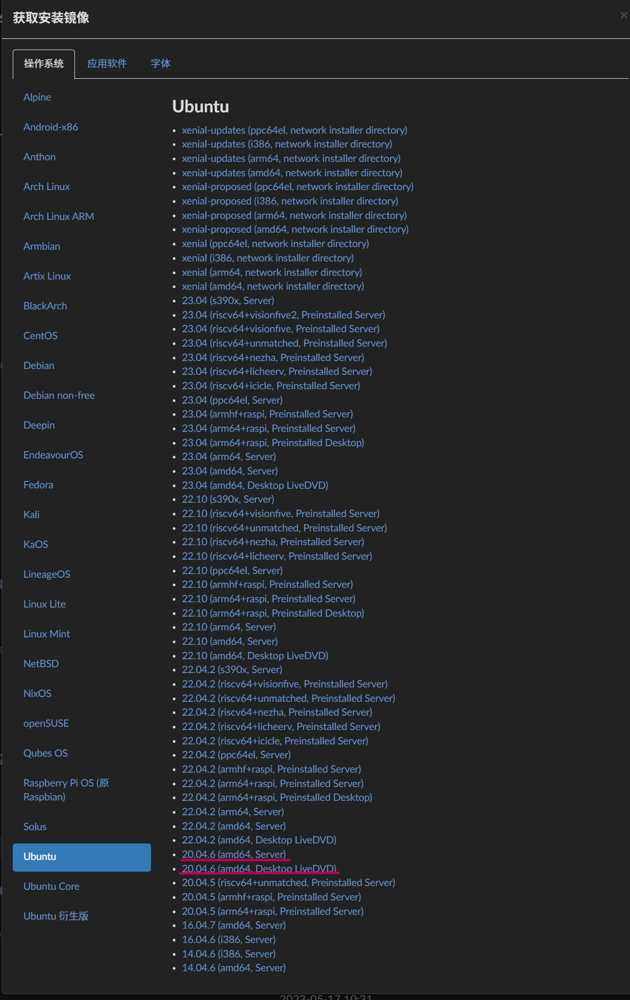
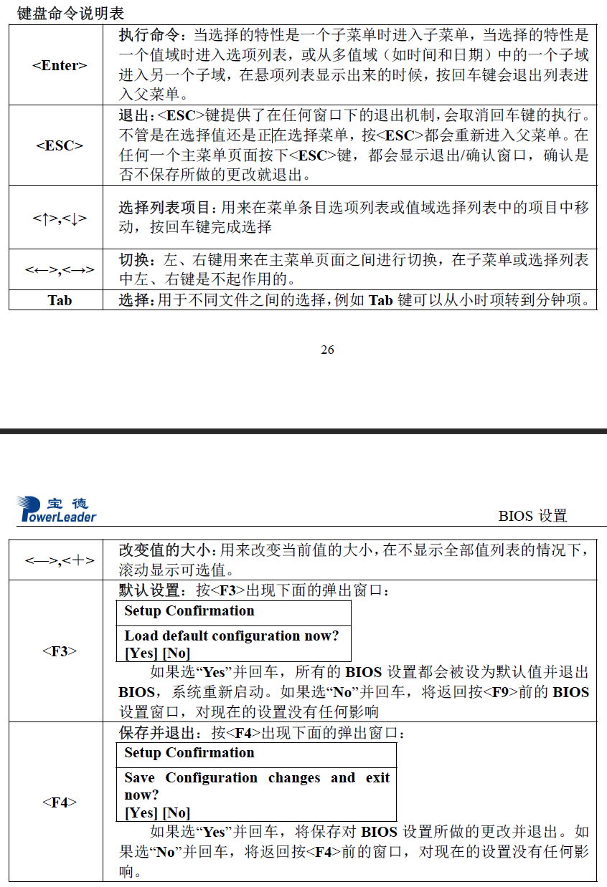
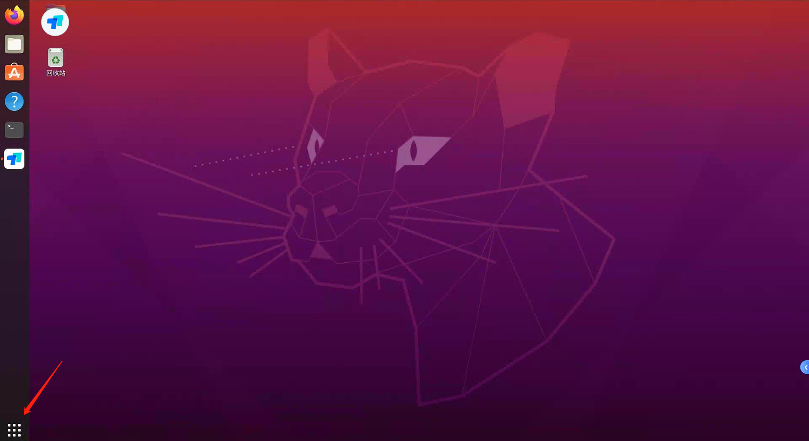
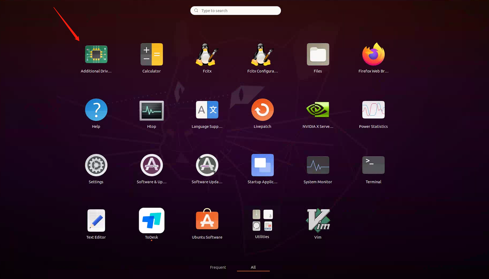
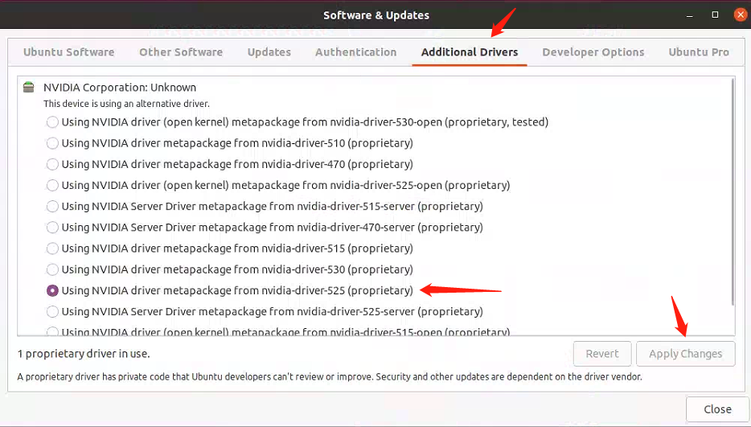

# 安装Ubuntu
## 准备工作
1. 下载Ubuntu 20.04 ISO镜像文件.  
可以访问Ubuntu官方网站[Here](https://ubuntu.com/download/desktop)，或者清华镜像[Here](https://mirrors.tuna.tsinghua.edu.cn/)进行下载。目前最新LTS版本为Ubuntu 22.04,但考虑到稳定性和支持，Ubuntu 20.04是一个经过长时间测试和稳定的版本，有更广泛的社区支持和文档资源。所以本文档采用Ubuntu20.04和清华镜像网站为例。
点击页面右侧"获取下载链接"

选择红色划线选项，2选1。它们的主要区别:
- Ubuntu Desktop提供了图形化的用户界面，可以轻松使用和操作系统进行交互。它包含了桌面环境、窗口管理器和各种预装的应用程序，以提供完整的桌面体验。而Ubuntu Server则没有预装图形用户界面，它主要通过命令行界面进行操作。
- Ubuntu Desktop和Ubuntu Server并不是互斥的，可以在Ubuntu Desktop上安装服务器软件包和服务，或者在Ubuntu Server上安装桌面环境，根据自己的需求进行自定义配置。

这里以Desktop版本为例。当ISO文件下载完毕后：
- 如果你使用Windows系统:  
使用 Rufus 创建 Ubuntu 安装 U盘，U盘最好选择大于等于16GB的。  
在“设备”下拉列表中选中自己的U盘，点击“选择”按钮选中下载好的ISO镜像文件。其他选项可以不用更改，然后点击“开始按钮”。

如果遇到该提示，选择以ISO镜像模式写入并点击OK
此时，Rufus 会提示U盘上的所有数据将被清除，认真确认没有重要文件之后再点「确定」按钮开始写入。

写入完成后，点击软件右下角关闭按钮。

## 进入BIOS
1. 将U盘插入服务器
2. 按下开机按钮并且不断点击DEL键进入BIOS系统。这个是宝德手册提供按键说明以供参考

3. 进入BIOS后选择开机启动项，选中U盘启动项(通常包含UEFI字符)。
4. 保存并退出。服务器会自动重启
## 安装Ubuntu
1. 重启服务器后会出现如下界面

系统正在检查安装程序是否有误，为了节约时间可以按"Ctrl+C"跳过
2. 等待服务器进入Ubuntu安装程序后，会出现如下界面

选择"Install Ubuntu"
3. 按照图示进行选择


当进行到"Installation Type"这一步时，选择"Erase disk and install Ubuntu".此时会提示将会抹去整个磁盘，检查确认服务器没有重要资料后，选择确认。  
随后配置服务器的账户名与密码，请自己牢记。
## 配置网络
由于校园网管理原因，实验室服务器的ip与MAC地址是绑定存在的。当配置服务器网络时，需要先知道所配置服务器的MAC地址。这里以一台服务器为例:

其中子网掩码Netmask，网关Gateway和域名解析服务DNS可以设置成一样的。IP地址Address需对照表格进行填写。
## 更换apt镜像
有两种更换源地址的方式:  
1. 使用Terminal进行。Ubuntu 的软件源配置文件是 /etc/apt/sources.list。当你编辑该文件时，请使用sudo或者root用户。将sources.list替换为以下文本。
```
deb https://mirrors.tuna.tsinghua.edu.cn/ubuntu/ focal main restricted universe multiverse
deb https://mirrors.tuna.tsinghua.edu.cn/ubuntu/ focal-updates main restricted universe multiverse
deb https://mirrors.tuna.tsinghua.edu.cn/ubuntu/ focal-backports main restricted universe multiverse
deb http://security.ubuntu.com/ubuntu/ focal-security main restricted universe multiverse
```
然后输入“sudo apt update”或者当你是root用户时可以直接输入"apt update"

2. 使用Desktop进行  
打开该软件

在Download from中选择"Server of China"


# 安装NVIDIA驱动
1.

2.

3.

##重启机器

# 安装NVIDIA-docker
```
	curl https://get.docker.com | sh   && sudo systemctl --now enable docker

	distribution=$(. /etc/os-release;echo $ID$VERSION_ID) \
      && curl -fsSL https://nvidia.github.io/libnvidia-container/gpgkey | sudo gpg --dearmor -o /usr/share/keyrings/nvidia-container-toolkit-keyring.gpg \
      && curl -s -L https://nvidia.github.io/libnvidia-container/$distribution/libnvidia-container.list | \
            sed 's#deb https://#deb [signed-by=/usr/share/keyrings/nvidia-container-toolkit-keyring.gpg] https://#g' | \
            sudo tee /etc/apt/sources.list.d/nvidia-container-toolkit.list

	sudo apt-get update
	sudo apt-get install -y nvidia-docker2
	sudo systemctl restart docker
```
## 测试docker是否能够使用
```
sudo docker run --rm --gpus all nvidia/cuda:12.1.1-base-ubuntu20.04 nvidia-smi
```
